# Report about Recommended System

# Part 1: EDA (Exploratory Data Analysis)

### **Data Overview:**

- Details of Product of Men Fashion in Shopee: (Rating_details)
    
     it contains 4 columns: 
    
    - Product ID
    - user ID
    - Rating of Product by User

  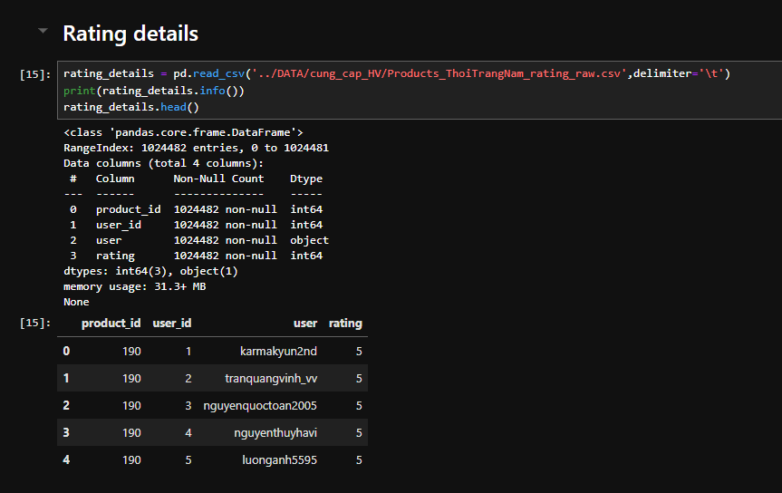
    
- Description of Men Fashion Product in Shopee: (prd_des_df)

  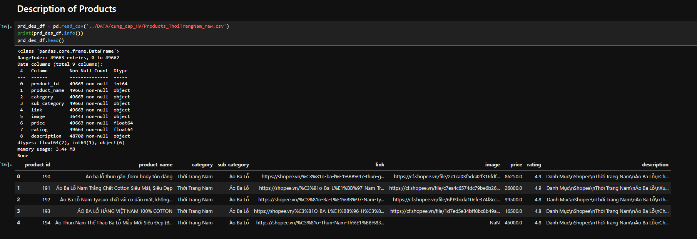
    

### **Data Cleaning:**

- Rating_Detail:
    - Remove NA values
    - Drop some unappropriated columns (column ”user” from Rating Detail)
    - Check unique values all columns
    - View Distribution of “Rating”
    
    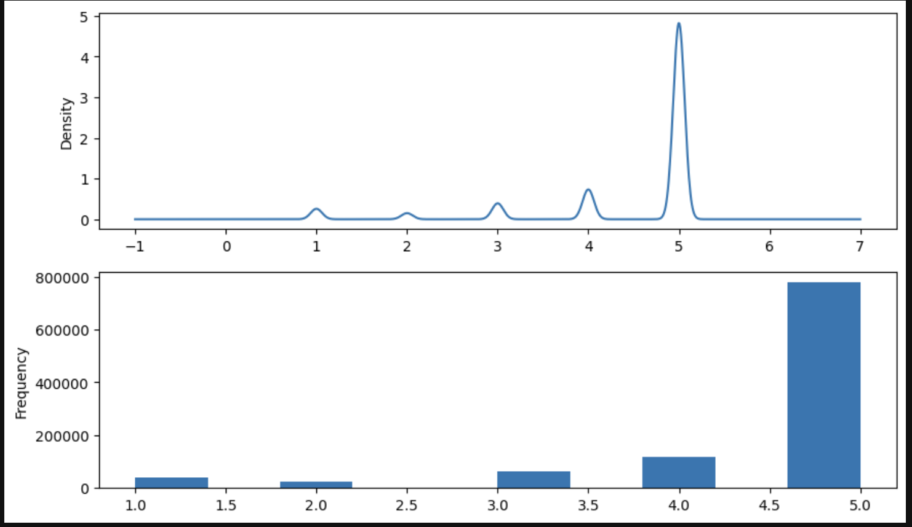
    
    - Drop some products with low rating and drop users with one purchase record.
    - Transform to Final Detail Dataframe and save to file CSV for using later.
        
        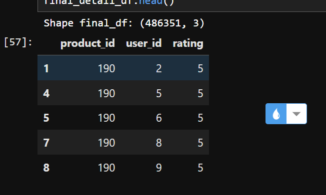
        
- Products_Description:
    - Check NA values, unique values of all columns.
        
        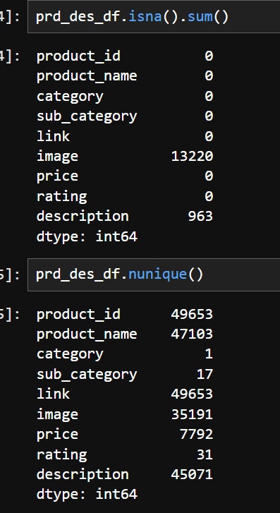
        
    - Drop duplicates in “product_id” and remove all null values of “description”
    - Drop some unnecessary columns: 'category', 'link', 'image’
    - Clean Text: use package “underthesea” and apply some methods for cleansing Text in “description” and “Product_name”. Then Transform them into “clean_desc” and “clean_prd_name”
    - Export the final version to prepare for next step
    
    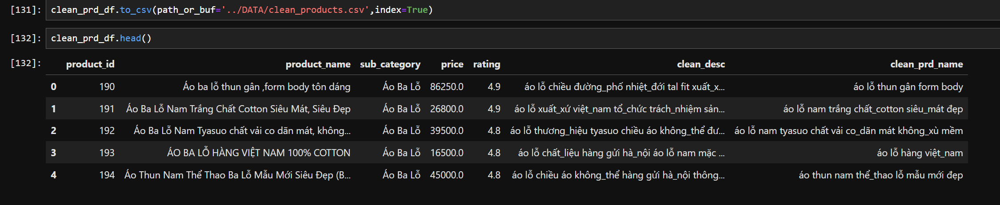
    

**Export to two cleaned file csv in order to use in build 2 Recommended System: Content-base and Collaborative Filtering.**

# Part 2: Collaborative Filtering:

## 1. Pypark ALS:

- Export and overview Data “clean details” which contains three main columns: Productid, user_id, rating
- Implement Explore Data Analysis:
    - Check distinct values
    - Check top5 distinct value count of each category columns in df
- Split the data into two parts: Trainset and Test set.
- Build Model ALS with the following params:
    - _maxIter = 10
    - _regParam = 0.01
    - _rank = 20
- Evaluate the model according to Test set:
    
    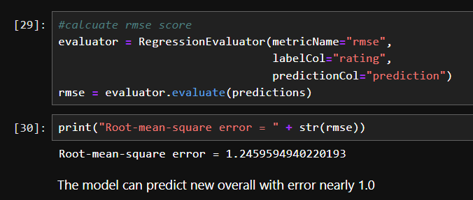
    
    <aside>
    💡 **The performance of this model is relatively slow, and I frequently encounter memory usage errors when using PySpark. Additionally, the root mean error is somewhat high at 1.24.
    When implementing this system for users, we need to prioritize speed. Therefore, I do not recommend this model for Collaborative Filtering.**
    
    </aside>
    
- Apply a function to recommend product by selecting a specific userID

```python
def make_recommendation(usr_id,result_: pd.DataFrame):
    #create a dictionary for user recommendation
    try:
        #create a dictionary for user recommendation
        fil_1 = result_['usr_id'] == user_id
        find_user_rec = result_[fil_1]
        recom = []
        for row in find_user_rec.itertuples(index=False):
            # Access columns using row.column_name
            dict_prd = {'product_id':row.product_id, 'rating':row.rating}
            recom.append(dict_prd)
            #print(row.usr_id, row.product_id, row.rating)
        
        recom_user_dict = {'user_id':user_id,'recom': recom}
        
        return recom_user_dict
    except Exception as e:
        no_value = 'There is no recommendation for this user'
        print(no_value)
        return None
```

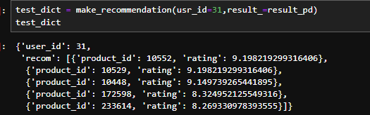

- **make recommendations to some users:**
    
    `Recommendation for UserID:  7078`
    
    |  | user_id | product_id | rating |
    | --- | --- | --- | --- |
    | 0 | 7078 | 11717.0 | 5.794730 |
    | 1 | 7078 | 232486.0 | 5.738311 |
    | 2 | 7078 | 21889.0 | 5.683164 |
    | 3 | 7078 | 172726.0 | 5.642112 |
    | 4 | 7078 | 19337.0 | 5.628994 |
    
    `Recommendation for UserID:  38482`
    
    |  | user_id | product_id | rating |
    | --- | --- | --- | --- |
    | 0 | 38482 | 16178.0 | 7.309280 |
    | 1 | 38482 | 19337.0 | 7.278183 |
    | 2 | 38482 | 234284.0 | 7.232375 |
    | 3 | 38482 | 21889.0 | 7.180694 |
    | 4 | 38482 | 11717.0 | 7.153756 |
    
    `Recommendation for UserID:  57980`
    
    |  | user_id | product_id | rating |
    | --- | --- | --- | --- |
    | 0 | 57980 | 232100.0 | 5.686516 |
    | 1 | 57980 | 13725.0 | 5.641470 |
    | 2 | 57980 | 231872.0 | 5.535635 |
    | 3 | 57980 | 13756.0 | 5.374990 |
    | 4 | 57980 | 19337.0 | 5.345009 |

## 2. Surprise:

1. **Export Clean Dataframe:** 
    
    ```
    <class 'pandas.core.frame.DataFrame'>
    RangeIndex: 486351 entries, 0 to 486350
    Data columns (total 3 columns):
     #   Column      Non-Null Count   Dtype
    ---  ------      --------------   -----
     0   product_id  486351 non-null  int64
     1   user_id     486351 non-null  int64
     2   rating      486351 non-null  int64
    ```
    
2. **Calculate Similarity Calculation between userIDs:** We determine how similar two items or users are based on their interaction with other items or users. Again, this can involve various similarity or distance measures.
3. Build Model: We use SVD with train test split with 80-20
4. Apply Cross Validation with 5 splits folds to calculate RSME and MAE
    
    ```
    Evaluating RMSE, MAE of algorithm SVD on 5 split(s).
    
                      Fold 1  Fold 2  Fold 3  Fold 4  Fold 5  Mean    Std
    RMSE (testset)    0.8846  0.8768  0.8789  0.8806  0.8785  0.8798  0.0027
    MAE (testset)     0.5606  0.5566  0.5573  0.5584  0.5572  0.5580  0.0014
    Fit time          8.70    8.55    8.94    8.59    8.79    8.71    0.14
    Test time         1.03    0.56    1.03    1.00    1.01    0.93    0.18
    ```
    
    <aside>
    💡 We can see the RMSE of SVD is better than ALS in Pyspark. Besides, the speed of Surprise also is greatly faster than that of ALS.
    
    </aside>
    
5. **Build function to Recommendation:** We predict a user's interest in an item based on the interests of similar users with rating greater than 3.

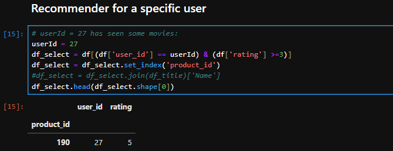

# Part 3: Content-based Filtering

## Gensim:

1. Check NA and clean data
2. Create the word dictionary and Corpus

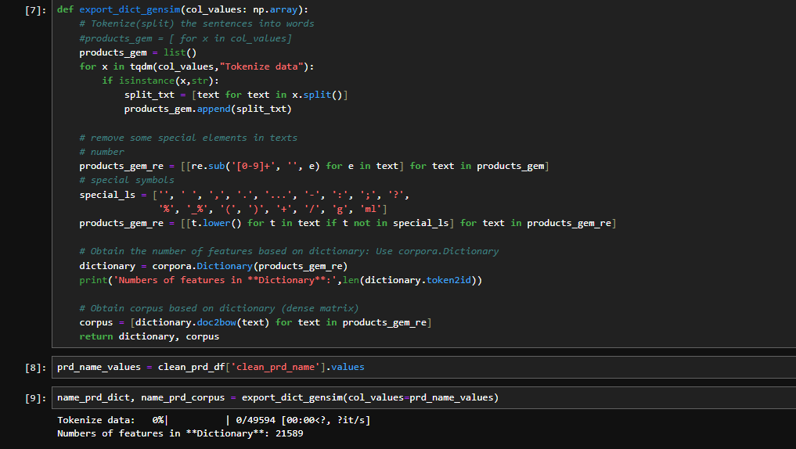

1. Apply Model TFIDF
2. Save **tfidf_model, corpus_dictionary, similarity_matrix.index**

## Similiarity:

1. Load Some Data to preprocess Vietnamese languages
2. Load clean data
3. Calculate TF-IDF with stop words 
4. Calcuate cosine_similarity
5. Build function recommend_cosine 

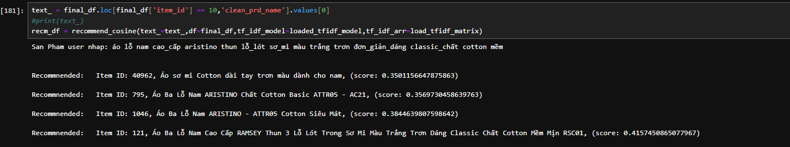

1. Save tfidf_vectorizer of all products and tfidf_matrix.npz, which is sparsed matrix of all products

## Final model for Content base filtering:

1. Build a class Cleanser to clean text

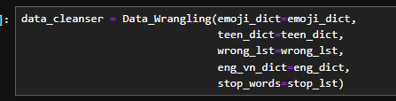

- Build Function to recommend product by Gensim and Similarity
    
    ```python
    # GENSIM
    def recommender_gensim(view_prd: str,
                           cleaner,
                           dict_prd: corpora.Dictionary,
                           tfidf_model: gensim.models.tfidfmodel.TfidfModel,
                           similarity: gensim.similarities.docsim.SparseMatrixSimilarity,
                           prd_df: pd.DataFrame):
        # Convert search words into Sparse Vectors
        clean_txt = cleaner.process_text(text=view_prd)
        clean_txt = cleaner.process_postag_thesea(clean_txt)
    
        clean_ls = clean_txt.split()
        kw_vector = dict_prd.doc2bow(clean_ls)
        print("View product's vector:")
        print(kw_vector)
    
        # similarity calculation
        sim = similarity[tfidf_model[kw_vector]]
    
        # print result
        list_id = []
        list_score = []
        for i in range(len(sim)):
            list_id.append(i)
            list_score.append(sim[i])
    
        # Create df
        df_res = pd.DataFrame({'item_id': list_id, 'score': list_score})
    
        # Get 5 highest score
        five_h_score = df_res.sort_values(by='score', ascending=False).head(6)
        print("Five highest scores:")
        print(five_h_score)
        print('IDS to list:')
        id_to_ls = five_h_score['item_id'].to_list()
        print(id_to_ls)
    
        # Find prd
        prd_find = prd_df[prd_df.index.isin(id_to_ls)]
        prd_results = prd_find[['product_id', 'product_name', 'clean_prd_name', 'sub_category', 'price', 'rating']]
        final = pd.concat([prd_results, five_h_score], axis=1).sort_values(by='score', ascending=False)
        final = final[final['score']!=1]
        return final
        
      # SIMILARITY
      def recommend_cosine(text_,
                         df,
                         cleaner,
                         tf_idf_model,
                         tf_idf_arr,
                         num=5):
        import warnings
        warnings.filterwarnings("ignore")
        # Convert search words into Sparse Vectors
        clean_txt = cleaner.process_text(text=text_)
        clean_txt = cleaner.process_postag_thesea(clean_txt)
    
        # Get Sparse Matrix from TFIDF
        txt_sparse_matrix = tf_idf_model.transform([clean_txt])
    
        # Calcualte the cosine score
        cosine_text_ = cosine_similarity(X=txt_sparse_matrix,
                                         Y=tf_idf_arr)
    
        top5_prd = cosine_text_.flatten().argsort()[-num-1:-1]
        top5_score = [(cosine_text_.flatten()[i]) for i in top5_prd]
    
        # Extract Product
        ls_item = []
        for id, sim in zip(top5_prd, top5_score):
            sim_item = {'item_id': id, 'score': sim}
            ls_item.append(sim_item)
        print(f"San Pham user nhap: {text_}\n\n")
        for rec in ls_item:
            # print(rec[1])
            print(
                f"Recommnended:\tItem ID: {rec['item_id']}, 
                {df.loc[df['item_id'] == rec['item_id'], 'product_name'].values[0]}, 
                (score: {rec['score']})\n")
    
        # Create DataFrame
        df_res = pd.DataFrame(ls_item)
        filter_ls = df_res['item_id'].to_list()
        prd_find = df[df['item_id'].isin(filter_ls)]
        prd_results = pd.merge(left=prd_find,
                               right=df_res,
                               on=['item_id'],
                               how='inner')
        
        final = prd_results.sort_values(by='score', ascending=False)
        #final = final[final['score']!=1]
        feat = ['product_id', 'product_name', 'clean_prd_name', 'sub_category', 'price', 'rating','item_id','score']
        return final[feat]
        
     # Combine both:
     def combine_both(gensim_df, cosim_df):
        combine_df = pd.merge(cosim_df,
                         gensim_df,
                         on=['product_id','product_name','clean_prd_name','sub_category','price','rating'],
                         suffixes=('_gensim', '_simi'), 
                         how='outer').drop(columns=['item_id_gensim','item_id_simi'])
        combine_df[combine_df['rating']>3]
        return combine_df
    ```
    
- Apply Gensim model
    - Load model, word dictionary and similarity matrix
    - Get all products with high correlation
    
    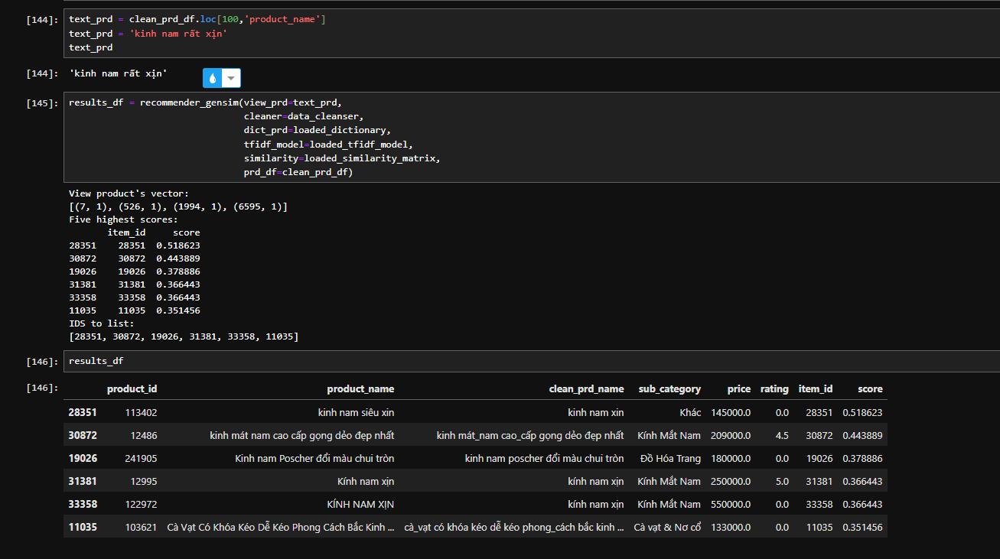
    
- Apply Consine model
    - Load model, word dictionary and similarity matrix
    - Get all products with high correlation
    
    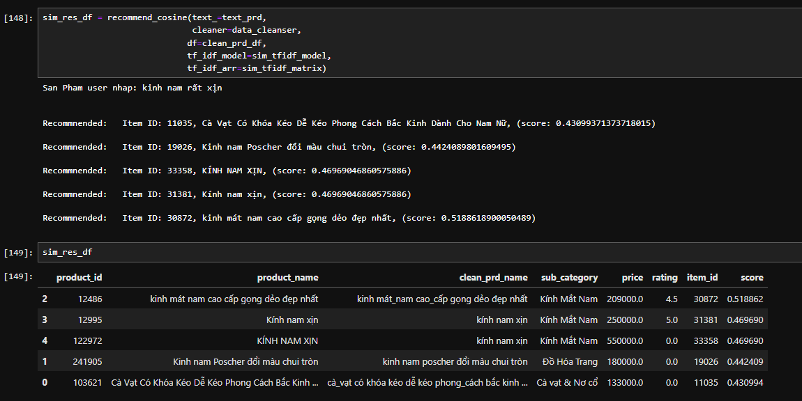
    
- Combine both model get outer:
    
    Merge outer between 2 datframes
    
    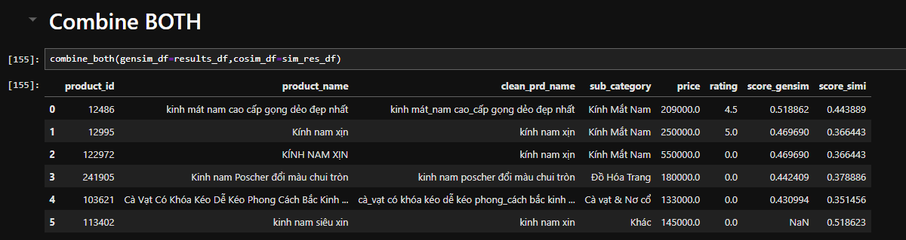
